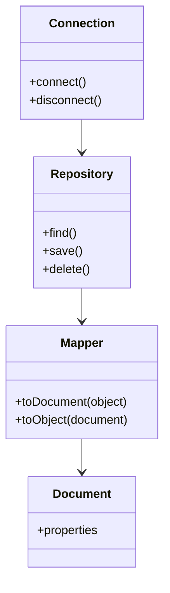

# ODM Framework Dokumentation

## Überblick

Das ODM (Object Document Mapper) Framework dient zur Abbildung von Datenbank-Dokumenten auf PHP-Objekte. Es vereinfacht die Arbeit mit dokumentenorientierten Datenbanken wie MongoDB, indem es die Datenbankoperationen kapselt und ein objektorientiertes API bereitstellt.

## Aufbau des ODM

Das Framework besteht typischerweise aus folgenden Komponenten:

- **Document**: Repräsentiert ein Datenbank-Dokument als PHP-Klasse.
- **Repository**: Stellt Methoden zum Laden, Speichern und Löschen von Dokumenten bereit.
- **Mapper**: Wandelt zwischen PHP-Objekten und Datenbank-Dokumenten.
- **Connection**: Verwaltet die Verbindung zur Datenbank.

### Diagramm



## Beispielcode

```php
// Beispiel: Verwendung des ODM Frameworks

use Odm\Connection;
use Odm\Repository;
use Odm\Document;

// Verbindung herstellen
$connection = new Connection('mongodb://localhost:27017');
$repository = new Repository($connection, Document::class);

// Neues Dokument erstellen
$doc = new Document();
$doc->title = 'Beispiel';
$doc->content = 'Das ist ein Test.';

// Dokument speichern
$repository->save($doc);

// Dokumente abfragen
$docs = $repository->find(['title' => 'Beispiel']);
foreach ($docs as $item) {
    echo $item->content;
}
```

## Extern verwendete Bibliotheken

- **mongodb/mongodb**: Offizieller MongoDB PHP-Treiber ([Packagist](https://packagist.org/packages/mongodb/mongodb))
- **doctrine/annotations**: Für Annotationen in Dokumentklassen ([Packagist](https://packagist.org/packages/doctrine/annotations))
- **symfony/cache** (optional): Für Caching von Abfragen ([Packagist](https://packagist.org/packages/symfony/cache))

## Weitere Hinweise

- Die Dokumentklassen sollten mit passenden Annotationen versehen werden, um die Zuordnung zu Feldern in der Datenbank zu ermöglichen.
- Das Repository übernimmt die CRUD-Operationen und nutzt den Mapper für die Konvertierung.

## Annotationen Übersicht

| Annotation           | Beschreibung                                                    | Parameter                                    |
|----------------------|-----------------------------------------------------------------|----------------------------------------------|
| `@Document`          | Markiert eine Klasse als Datenbank-Dokument.                    | `collection` (optional)                      |
| `@EmbeddedDocument`  | Markiert eine Klasse als eingebettetes Dokument.                | keine                                        |
| `@Id`                | Kennzeichnet das Feld als eindeutige ID des Dokuments.          | keine                                        |
| `@Field`             | Definiert ein Feld im Dokument und dessen Typ.                  | `type` (`string`, `int`, `bool`, `date`), `name` (optional), `nullable` (optional, `true`/`false`), `default` (optional) |
| `@ReferenceOne`      | Referenz zu einem anderen Dokument (1:1 Beziehung).             | `target`, `cascade` (optional)               |
| `@ReferenceMany`     | Referenz zu mehreren Dokumenten (1:n Beziehung).                | `target`, `cascade` (optional)               |
| `@EmbedOne`          | Ein einzelnes eingebettetes Dokument.                           | `target`                                     |
| `@EmbedMany`         | Mehrere eingebettete Dokumente.                                 | `target`                                     |
| `@Index`             | Erstellt einen Index auf das Feld.                              | `unique`, `order` (optional)                 |

### Beispiel für Annotationen in einer Dokumentklasse

```php
/**
 * @Document(collection="users")
 */
class User
{
    /**
     * @Id
     */
    public $id;

    /**
     * @Field(type="string", name="username")
     */
    public $name;

    /**
     * @ReferenceMany(target="Post")
     */
    public $posts;

    /**
     * @EmbedOne(target="Address")
     */
    public $address;

    /**
     * @EmbedMany(target="Phone")
     */
    public $phones;
}

/**
 * @EmbeddedDocument
 */
class Address
{
    /**
     * @Field(type="string")
     */
    public $street;

    /**
     * @Field(type="string")
     */
    public $city;
}

/**
 * @EmbeddedDocument
 */
class Phone
{
    /**
     * @Field(type="string")
     */
    public $number;
}
```

