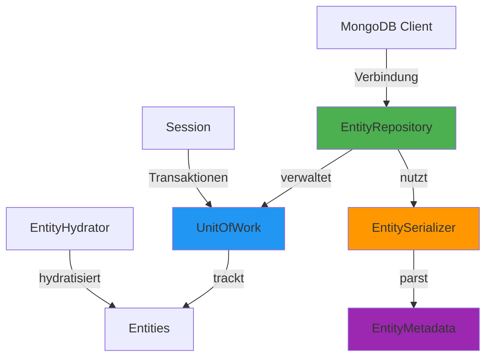
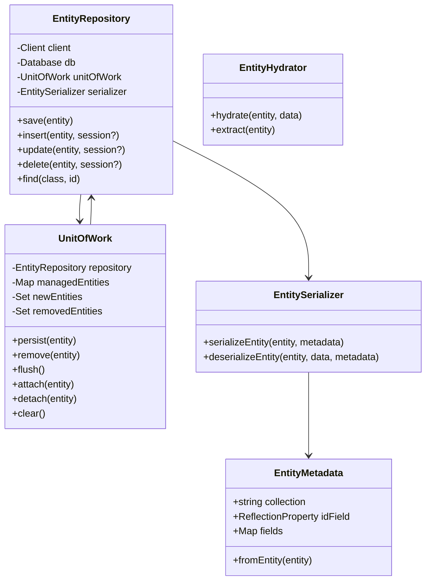

# ODM Framework Dokumentation

## Überblick

Das ODM (Object Document Mapper) Framework in ARPI-ISMS ist ein vollständiges Mapping-System zur Abbildung von MongoDB-Dokumenten auf PHP-Objekte. Es bietet Annotation-basierte Konfiguration, Change Tracking, Transaktions-Support und automatische Serialisierung.

## Architektur-Überblick



## Kernkomponenten

### 1. EntityRepository

Die zentrale Klasse für alle Datenbankoperationen.

**Hauptfunktionen:**
- CRUD-Operationen (Create, Read, Update, Delete)
- Session-Management für Transaktionen
- Integration mit UnitOfWork
- Automatische Collection-Auswahl

**Initialisierung:**
```php
use ARPI\Helper\ODM\EntityRepository;

$repository = new EntityRepository(
    'mongodb://localhost:27017',  // MongoDB URI
    'arpi'                         // Datenbank-Name
);
```

### 2. UnitOfWork

Verwaltet Entity-Lebenszyklus und Change Tracking.

**Funktionen:**
- Automatisches Change Tracking
- Batch-Operationen (Flush)
- Transaktions-Support
- Entity-Status-Verwaltung (NEW, MANAGED, REMOVED)

**Verwendung:**
```php
use ARPI\Helper\ODM\UnitOfWork;

$unitOfWork = new UnitOfWork($repository);

// Entity registrieren
$unitOfWork->persist($vm);

// Änderungen speichern
$unitOfWork->flush();
```

### 3. EntitySerializer

Konvertiert zwischen PHP-Objekten und MongoDB-Dokumenten.

**Funktionen:**
- Serialisierung von Entities zu Arrays
- Deserialisierung von MongoDB-Dokumenten zu Entities
- Type-Konvertierung (DateTime, ObjectId, etc.)
- Nested Properties Support

### 4. EntityMetadata

Parst Annotations und speichert Metadaten.

**Funktionen:**
- Annotation-Parsing
- Field-Mapping
- Index-Definitionen
- Collection-Namen

### 5. EntityHydrator

Statisches Utility für schnelle Hydratisierung.

**Funktionen:**
- Schnelles Befüllen von Entities aus Arrays
- Type-Konvertierung
- Nested Property Access

### 6. BaseSite Integration

Alle Wizard-Klassen, die von `BaseSite` erben, haben automatisch Zugriff auf EntityRepository und UnitOfWork.

**Verfügbare Methoden:**
- `persist(object $entity)`: Entity zur UnitOfWork hinzufügen
- `remove(object $entity)`: Entity zum Löschen markieren
- `flush()`: Alle Änderungen speichern
- `find(string $class, $id)`: Entity laden
- `isEntityDirty(object $entity)`: Prüfen ob Entity geändert wurde
- `clearUnitOfWork()`: UnitOfWork leeren
- `transaction(callable $callback)`: In Transaktion ausführen

**Beispiel:**
```php
class MyWizard extends BaseSite
{
    public function create(array $data): array
    {
        $vm = new VM();
        EntityHydrator::hydrate($vm, $data);
        
        // Direkt über BaseSite-Methoden
        $this->persist($vm);
        $this->flush();
        
        return ['success' => true, 'id' => (string)$vm->id];
    }
}
```

## Vollständige Architektur



## Annotationen Referenz

### @Document

Markiert eine Klasse als MongoDB-Dokument.

**Parameter:**
- `collection` (string, required): MongoDB Collection-Name

**Beispiel:**
```php
use ARPI\ODM\Mapping\Annotations as ODM;

/**
 * @ODM\Document(collection="virtualmachines")
 */
class VM { }
```

### @Id

Markiert das MongoDB ObjectId-Feld.

**Beispiel:**
```php
use MongoDB\BSON\ObjectId;

/**
 * @ODM\Id
 */
public ObjectId $id;
```

**Wichtig:**
- Wird automatisch von MongoDB generiert
- Wird nach `insert()` automatisch gesetzt
- Typ MUSS `MongoDB\BSON\ObjectId` sein

### @Field

Definiert ein Feld im Dokument.

**Parameter:**
- `type` (string, required): Datentyp
  - `string`, `int`, `float`, `bool`
  - `date` (für DateTime)
  - `array` (für Arrays)
- `name` (string, optional): MongoDB-Feldname (wenn abweichend)
- `nullable` (bool, default: false): Null-Werte erlaubt
- `default` (mixed, optional): Default-Wert

**Beispiele:**
```php
/**
 * @ODM\Field(type="string")
 */
public string $hostname;

/**
 * @ODM\Field(type="string", name="ip_address", nullable=true)
 */
public ?string $ipaddress = null;

/**
 * @ODM\Field(type="int", default=0)
 */
public int $port = 0;

/**
 * @ODM\Field(type="date")
 */
public \DateTime $createdAt;

/**
 * @ODM\Field(type="array")
 */
public array $tags = [];
```

### @Index

Definiert Indizes für die Collection.

**Parameter:**
- `unique` (bool, optional): Eindeutiger Index
- `order` (string, optional): 'asc' oder 'desc'

**Beispiele:**
```php
/**
 * @ODM\Field(type="string")
 * @ODM\Index(unique=true)
 */
public string $uuid;

/**
 * @ODM\Field(type="string")
 * @ODM\Index
 */
public string $hostname;
```

## Vollständiges Entity-Beispiel

```php
<?php
namespace ARPI\Entities\Documents;

use ARPI\ODM\Mapping\Annotations as ODM;
use MongoDB\BSON\ObjectId;

/**
 * Eine Virtuelle Maschine in der CMDB.
 * 
 * @ODM\Document(collection="virtualmachines")
 */
class VM
{
    /**
     * @ODM\Id
     */
    public ObjectId $id;

    /**
     * @ODM\Field(type="string")
     * @ODM\Index(unique=true)
     */
    public string $uuid;

    /**
     * @ODM\Field(type="string")
     */
    public string $hostname;

    /**
     * @ODM\Field(type="string", nullable=true)
     */
    public ?string $ipaddress = null;

    /**
     * @ODM\Field(type="string", nullable=true)
     */
    public ?string $operatingsystem = null;

    /**
     * @ODM\Field(type="int", nullable=true)
     */
    public ?int $vcpu = null;

    /**
     * @ODM\Field(type="int", nullable=true)
     */
    public ?int $ramingb = null;

    /**
     * @ODM\Field(type="date")
     */
    public \DateTime $createdAt;

    /**
     * @ODM\Field(type="date")
     */
    public \DateTime $updatedAt;

    public function __construct()
    {
        $this->uuid = uniqid('vm_', true);
        $this->createdAt = new \DateTime();
        $this->updatedAt = new \DateTime();
    }

    public function __toString(): string
    {
        return $this->hostname . ($this->ipaddress ? " ({$this->ipaddress})" : '');
    }
}
```

## Verwendung des ODM

### 1. Einfache CRUD-Operationen (ohne UnitOfWork)

#### Entity erstellen und speichern

```php
use ARPI\Helper\ODM\EntityRepository;
use ARPI\Entities\Documents\VM;

$repository = new EntityRepository('mongodb://localhost:27017', 'arpi');

// Entity erstellen
$vm = new VM();
$vm->hostname = 'web-server-01';
$vm->ipaddress = '192.168.1.100';
$vm->vcpu = 4;
$vm->ramingb = 16;

// Speichern
$result = $repository->save($vm);
echo "Inserted ID: " . $result->getInsertedId();
```

#### Entity laden

```php
use MongoDB\BSON\ObjectId;

// By ObjectId
$vm = $repository->find(VM::class, new ObjectId('507f1f77bcf86cd799439011'));

// By String ID
$vm = $repository->find(VM::class, '507f1f77bcf86cd799439011');

if ($vm) {
    echo $vm->hostname; // 'web-server-01'
}
```

#### Entity aktualisieren

```php
// Laden
$vm = $repository->find(VM::class, $id);

// Ändern
$vm->ramingb = 32;
$vm->updatedAt = new \DateTime();

// Speichern
$result = $repository->update($vm);
```

#### Entity löschen

```php
$vm = $repository->find(VM::class, $id);
$result = $repository->delete($vm);
```

### 2. Mit UnitOfWork (empfohlen)

#### Setup

```php
use ARPI\Helper\ODM\EntityRepository;
use ARPI\Helper\ODM\UnitOfWork;

$repository = new EntityRepository('mongodb://localhost:27017', 'arpi');
$unitOfWork = new UnitOfWork($repository);
$repository->setUnitOfWork($unitOfWork);
```

#### Neue Entities erstellen

```php
// Mehrere Entities erstellen
$vm1 = new VM();
$vm1->hostname = 'web-server-01';
$vm1->ipaddress = '192.168.1.100';

$vm2 = new VM();
$vm2->hostname = 'db-server-01';
$vm2->ipaddress = '192.168.1.101';

// Zur UnitOfWork hinzufügen
$unitOfWork->persist($vm1);
$unitOfWork->persist($vm2);

// Alle auf einmal speichern
$unitOfWork->flush();
```

#### Entities aktualisieren

```php
// Entity laden (wird automatisch tracked)
$vm = $repository->find(VM::class, $id);

// Änderungen vornehmen
$vm->ramingb = 32;
$vm->vcpu = 8;
$vm->updatedAt = new \DateTime();

// UnitOfWork erkennt Änderungen automatisch
$unitOfWork->flush();
```

#### Entities löschen

```php
$vm = $repository->find(VM::class, $id);

// Zum Löschen markieren
$unitOfWork->remove($vm);

// Löschen ausführen
$unitOfWork->flush();
```

#### UnitOfWork zurücksetzen

```php
// Alle Änderungen verwerfen
$unitOfWork->clear();
```

### 3. Transaktionen

```php
use ARPI\Helper\ODM\EntityRepository;
use ARPI\Helper\ODM\UnitOfWork;

$repository = new EntityRepository('mongodb://localhost:27017', 'arpi');
$unitOfWork = new UnitOfWork($repository);

try {
    // Transaction starten
    $session = $repository->getClient()->startSession();
    $session->startTransaction();
    
    // Mehrere Operationen
    $vm1 = new VM();
    $vm1->hostname = 'web-server-01';
    $unitOfWork->persist($vm1);
    
    $vm2 = new VM();
    $vm2->hostname = 'db-server-01';
    $unitOfWork->persist($vm2);
    
    // Flush mit Session
    $unitOfWork->flush($session);
    
    // Commit
    $session->commitTransaction();
    
} catch (\Exception $e) {
    // Rollback bei Fehler
    $session->abortTransaction();
    throw $e;
}
```

### 4. Mit EntityHydrator

```php
use ARPI\Helper\ODM\EntityHydrator;

// Aus Array hydratisieren
$data = [
    'hostname' => 'app-server-01',
    'ipaddress' => '10.0.1.50',
    'vcpu' => 4,
    'ramingb' => 16,
    'operatingsystem' => 'Ubuntu 22.04 LTS'
];

$vm = new VM();
EntityHydrator::hydrate($vm, $data);

// Speichern
$repository->save($vm);

// Zu Array extrahieren
$data = EntityHydrator::extract($vm);
```

## MongoDB-Queries

Da `EntityRepository` direkt mit MongoDB arbeitet, kannst du auch direkt auf Collections zugreifen:

### Collection-Zugriff

```php
$collection = $repository->getClient()
    ->selectDatabase('arpi')
    ->selectCollection('virtualmachines');

// Direkte MongoDB-Queries
$cursor = $collection->find(['hypervisor' => 'esxi-prod-01']);

foreach ($cursor as $document) {
    $vm = new VM();
    $repository->getSerializer()->deserializeEntity(
        $vm,
        $document,
        \ARPI\Helper\ODM\EntityMetadata::fromEntity($vm)
    );
    echo $vm->hostname . "\n";
}
```

### Query-Beispiele

```php
// Find mit Filter
$cursor = $collection->find([
    'ramingb' => ['$gte' => 32],
    'operatingsystem' => ['$regex' => '^Ubuntu']
]);

// Find mit Optionen
$cursor = $collection->find(
    ['hypervisor' => 'esxi-prod-01'],
    [
        'sort' => ['hostname' => 1],
        'limit' => 10,
        'skip' => 0
    ]
);

// Aggregation
$pipeline = [
    ['$group' => [
        '_id' => '$hypervisor',
        'totalVMs' => ['$sum' => 1],
        'totalRAM' => ['$sum' => '$ramingb']
    ]],
    ['$sort' => ['totalVMs' => -1]]
];

$cursor = $collection->aggregate($pipeline);
```

## EntitySerializer im Detail

### Serialisierung (Entity → MongoDB)

```php
use ARPI\Helper\ODM\EntitySerializer;
use ARPI\Helper\ODM\EntityMetadata;

$serializer = new EntitySerializer();
$metadata = EntityMetadata::fromEntity($vm);

// Entity zu Array serialisieren
$data = $serializer->serializeEntity($vm, $metadata);

// Result: [
//     '_id' => ObjectId(...),
//     'uuid' => 'vm_...',
//     'hostname' => 'web-server-01',
//     'ipaddress' => '192.168.1.100',
//     'vcpu' => 4,
//     'ramingb' => 16,
//     'createdAt' => UTCDateTime(...),
//     'updatedAt' => UTCDateTime(...)
// ]
```

### Deserialisierung (MongoDB → Entity)

```php
$vm = new VM();
$metadata = EntityMetadata::fromEntity($vm);

// MongoDB-Dokument zu Entity deserialisieren
$serializer->deserializeEntity($vm, $document, $metadata);

// $vm ist jetzt befüllt mit Daten aus $document
```

**Features:**
- ✅ Automatische Type-Konvertierung
- ✅ DateTime ↔ MongoDB\BSON\UTCDateTime
- ✅ ObjectId-Handling
- ✅ Nested Properties
- ✅ Null-Handling

## UnitOfWork im Detail

### Entity-Status

```php
use ARPI\Helper\ODM\EntityState;

// Mögliche Stati:
EntityState::NEW       // Neu, noch nicht in DB
EntityState::MANAGED   // Von DB geladen, wird getrackt
EntityState::REMOVED   // Zum Löschen markiert
EntityState::DETACHED  // Nicht mehr getrackt
```

### Change Tracking

```php
$unitOfWork = new UnitOfWork($repository);

// Entity laden (wird MANAGED)
$vm = $repository->find(VM::class, $id);

// Änderungen vornehmen
$vm->ramingb = 64;

// UnitOfWork vergleicht aktuellen State mit Original-Snapshot
$unitOfWork->flush(); // Erkennt Änderung automatisch
```

### Batch-Operationen

```php
// Mehrere Entities in einem Durchgang
$unitOfWork->persist($vm1);
$unitOfWork->persist($vm2);
$unitOfWork->persist($vm3);

$vm4 = $repository->find(VM::class, $id4);
$vm4->ramingb = 128; // Wird automatisch getrackt

$unitOfWork->remove($vm5);

// Alle Operationen auf einmal ausführen
$unitOfWork->flush();
```

### Entities verwalten

```php
// Entity zum Tracking hinzufügen
$unitOfWork->attach($vm);

// Entity vom Tracking entfernen
$unitOfWork->detach($vm);

// Alle Entities vom Tracking entfernen
$unitOfWork->clear();

// Status prüfen
$state = $unitOfWork->getEntityState($vm);
```

## Wizard-Integration

Typische Verwendung in ARPI-ISMS Wizards (vereinfacht durch BaseSite):

```php
<?php
namespace ARPI\Sites\Wizards;

use ARPI\Helper\BaseSite;
use ARPI\Helper\SchemaValidator;
use ARPI\Helper\ODM\EntityHydrator;
use ARPI\Schemas\VMSchema;
use ARPI\Entities\Documents\VM;

class NewVM extends BaseSite
{
    // EntityRepository und UnitOfWork sind automatisch verfügbar!
    // Keine manuelle Initialisierung mehr nötig
    
    public function main(): string
    {
        return $this->renderTemplate('pages/wizards/new-vm.html');
    }
    
    public function create(array $data): array
    {
        // 1. Validierung
        $validator = new SchemaValidator();
        if (!$validator->validate($data, VMSchema::getSchema())) {
            return [
                'success' => false,
                'errors' => $validator->getErrors()
            ];
        }
        
        try {
            // 2. Entity erstellen und hydratisieren
            $vm = new VM();
            EntityHydrator::hydrate($vm, $data);
            
            // 3. Über BaseSite-Methoden persistieren
            $this->persist($vm);
            $this->flush();
            
            // 4. Erfolg zurückgeben
            return [
                'success' => true,
                'id' => (string)$vm->id,
                'message' => 'VM erfolgreich erstellt'
            ];
            
        } catch (\Exception $e) {
            return [
                'success' => false,
                'errors' => [$e->getMessage()]
            ];
        }
    }
    
    public function update(string $id, array $data): array
    {
        $validator = new SchemaValidator();
        if (!$validator->validate($data, VMSchema::getSchema())) {
            return [
                'success' => false,
                'errors' => $validator->getErrors()
            ];
        }
        
        try {
            // Entity laden (über BaseSite)
            $vm = $this->find(VM::class, $id);
            
            if (!$vm) {
                return [
                    'success' => false,
                    'errors' => ['VM nicht gefunden']
                ];
            }
            
            // Daten aktualisieren
            EntityHydrator::hydrate($vm, $data);
            $vm->updatedAt = new \DateTime();
            
            // UnitOfWork erkennt Änderungen automatisch
            $this->flush();
            
            return [
                'success' => true,
                'id' => (string)$vm->id,
                'message' => 'VM erfolgreich aktualisiert'
            ];
            
        } catch (\Exception $e) {
            return [
                'success' => false,
                'errors' => [$e->getMessage()]
            ];
        }
    }
    
    public function delete(string $id): array
    {
        try {
            $vm = $this->find(VM::class, $id);
            
            if (!$vm) {
                return [
                    'success' => false,
                    'errors' => ['VM nicht gefunden']
                ];
            }
            
            $this->remove($vm);
            $this->flush();
            
            return [
                'success' => true,
                'message' => 'VM erfolgreich gelöscht'
            ];
            
        } catch (\Exception $e) {
            return [
                'success' => false,
                'errors' => [$e->getMessage()]
            ];
        }
    }
    
    /**
     * Beispiel: Mit Transaktion
     */
    public function bulkCreate(array $vmDataList): array
    {
        try {
            $ids = $this->transaction(function($session) use ($vmDataList) {
                $insertedIds = [];
                
                foreach ($vmDataList as $data) {
                    $vm = new VM();
                    EntityHydrator::hydrate($vm, $data);
                    $this->persist($vm);
                    $insertedIds[] = $vm->uuid;
                }
                
                $this->flush();
                return $insertedIds;
            });
            
            return [
                'success' => true,
                'ids' => $ids,
                'message' => count($ids) . ' VMs erfolgreich erstellt'
            ];
            
        } catch (\Exception $e) {
            return [
                'success' => false,
                'errors' => [$e->getMessage()]
            ];
        }
    }
}
```

## Best Practices

### 1. BaseSite-Methoden nutzen (empfohlen)

```php
// ✅ Gut: BaseSite-Methoden verwenden
class MyWizard extends BaseSite
{
    public function save(array $data): void
    {
        $entity = new Entity();
        EntityHydrator::hydrate($entity, $data);
        $this->persist($entity);
        $this->flush();
    }
}

// ❌ Vermeiden: Manuelle Initialisierung
class MyWizard extends BaseSite
{
    public function save(array $data): void
    {
        $repo = new EntityRepository('mongodb://...', 'db');
        $uow = new UnitOfWork($repo);
        // ... unnötig kompliziert
    }
}
```

### 2. Transaktionen für Atomare Operationen

```php
try {
    $session = $repository->getClient()->startSession();
    $session->startTransaction();
    
    $unitOfWork->persist($vm1);
    $unitOfWork->persist($vm2);
    $unitOfWork->flush($session);
    
    $session->commitTransaction();
} catch (\Exception $e) {
    $session->abortTransaction();
}
```

### 3. Batch-Operationen statt Einzeln

```php
// ✅ Gut: Batch
foreach ($vms as $vm) {
    $unitOfWork->persist($vm);
}
$unitOfWork->flush(); // Ein DB-Call

// ❌ Vermeiden: Loop
foreach ($vms as $vm) {
    $repository->save($vm); // Viele DB-Calls
}
```

### 4. Clear bei langen Prozessen

```php
foreach ($largeDataset as $chunk) {
    foreach ($chunk as $data) {
        $entity = new Entity();
        EntityHydrator::hydrate($entity, $data);
        $unitOfWork->persist($entity);
    }
    
    $unitOfWork->flush();
    $unitOfWork->clear(); // Memory freigeben
}
```

### 5. Type Hints immer verwenden

```php
// ✅ Gut
public string $hostname;
public ?string $ipaddress = null;
public \DateTime $createdAt;

// ❌ Vermeiden
public $hostname; // Kein Type Hint
```

### 6. Constructor für Defaults

```php
public function __construct()
{
    $this->uuid = uniqid('vm_', true);
    $this->createdAt = new \DateTime();
    $this->updatedAt = new \DateTime();
    $this->tags = [];
}
```

## Performance-Tipps

### 1. Batch-Inserts verwenden

```php
// Viele Entities auf einmal
foreach ($data as $item) {
    $entity = new Entity();
    EntityHydrator::hydrate($entity, $item);
    $unitOfWork->persist($entity);
}
$unitOfWork->flush(); // Ein Batch-Insert
```

### 2. Clear() in langen Prozessen

```php
foreach ($largeDataset as $i => $item) {
    $entity = new Entity();
    EntityHydrator::hydrate($entity, $item);
    $unitOfWork->persist($entity);
    
    if ($i % 100 === 0) {
        $unitOfWork->flush();
        $unitOfWork->clear(); // Memory freigeben
    }
}
```

### 3. Indizes definieren

```php
/**
 * @ODM\Field(type="string")
 * @ODM\Index(unique=true)
 */
public string $uuid;

/**
 * @ODM\Field(type="string")
 * @ODM\Index
 */
public string $hostname;
```

### 4. Projection für große Dokumente

```php
$collection = $repository->getClient()
    ->selectDatabase('arpi')
    ->selectCollection('virtualmachines');

// Nur benötigte Felder laden
$cursor = $collection->find(
    [],
    ['projection' => ['hostname' => 1, 'ipaddress' => 1]]
);
```

## Troubleshooting

### Problem: "Cannot update entity without ID field"
**Ursache:** Entity hat kein `@ODM\Id` Feld  
**Lösung:** Füge `@ODM\Id` Property hinzu

### Problem: "Cannot update entity with null ID"
**Ursache:** Entity noch nicht gespeichert (ID ist null)  
**Lösung:** Erst `persist()` + `flush()`, dann `update()`

### Problem: "Entity not managed"
**Ursache:** Entity wurde nicht über `find()` geladen oder `attach()` aufgerufen  
**Lösung:** `$unitOfWork->attach($entity)` oder über `find()` laden

### Problem: "Session not started"
**Ursache:** Transaction-Methoden ohne Session aufgerufen  
**Lösung:** `$session = $client->startSession(); $session->startTransaction();`

### Problem: "Memory limit exceeded"
**Ursache:** Zu viele Entities im UnitOfWork  
**Lösung:** Regelmäßig `$unitOfWork->clear()` aufrufen

## Externe Bibliotheken

- **mongodb/mongodb**: Offizieller MongoDB PHP-Treiber ([Packagist](https://packagist.org/packages/mongodb/mongodb))
  - Version: ^2.1
  - Für direkte MongoDB-Operationen, Sessions, Transactions


## Weiterführende Ressourcen

- [MongoDB PHP Library Documentation](https://www.mongodb.com/docs/php-library/current/)
- [MongoDB Transactions](https://www.mongodb.com/docs/manual/core/transactions/)
- [PHP 8 Attributes](https://www.php.net/manual/en/language.attributes.overview.php)

