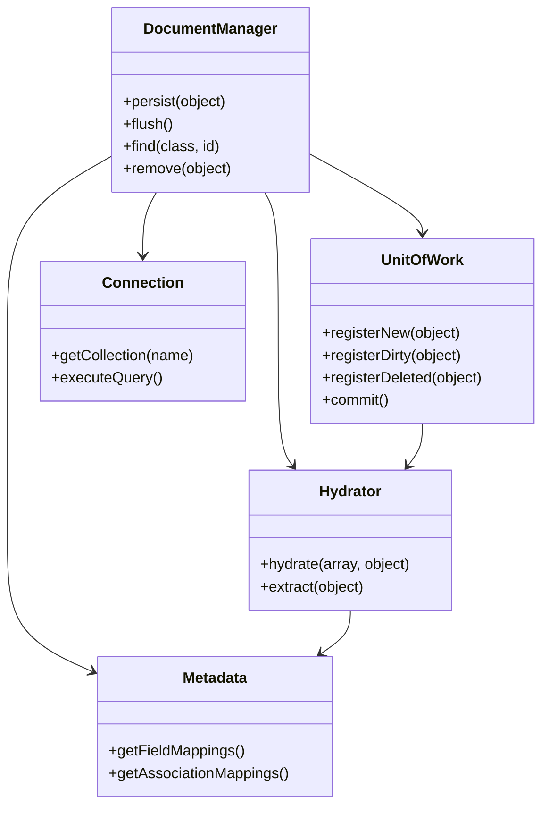

# ODM Framework Dokumentation

## Überblick

Das ODM (Object Document Mapper) Framework dient zur Abbildung von MongoDB-Dokumenten auf PHP-Objekte. Es vereinfacht die Arbeit mit dokumentenorientierten Datenbanken, indem es die Datenbankoperationen kapselt und ein objektorientiertes API bereitstellt.

## Kernkonzepte

### Annotations-basierte Mappings

Das ODM verwendet PHP 8 Attributes (Annotations) zur Konfiguration der Dokument-Struktur:

```php
use ARPI\ODM\Mapping\Annotations as ODM;

/**
 * @ODM\Document(collection="users")
 */
class User
{
    /**
     * @ODM\Id
     */
    public ObjectId $id;

    /**
     * @ODM\Field(type="string")
     */
    public string $username;

    /**
     * @ODM\Field(type="date")
     */
    public DateTime $createdAt;
}
```

## Aufbau des ODM

Das Framework besteht aus folgenden Komponenten:



### Komponenten-Beschreibung

- **DocumentManager**: Zentrale API für alle Datenbankoperationen
- **UnitOfWork**: Verwaltet Objekt-Lebenszyklus und Change Tracking
- **Hydrator**: Konvertiert zwischen MongoDB-Dokumenten und PHP-Objekten
- **Connection**: Abstrahiert MongoDB-Verbindung
- **Metadata**: Speichert Mapping-Informationen aus Annotations

## Annotationen Referenz

### Dokument-Level

#### @Document

Markiert eine Klasse als persistierbares Dokument.

**Parameter:**
- `collection` (string, optional): Collection-Name in MongoDB
- `repositoryClass` (string, optional): Custom Repository-Klasse

**Beispiel:**
```php
/**
 * @ODM\Document(
 *     collection="virtualmachines",
 *     repositoryClass="App\Repository\VMRepository"
 * )
 */
class VM { }
```

#### @EmbeddedDocument

Markiert eine Klasse als eingebettetes Dokument (kein eigenes Collection).

**Beispiel:**
```php
/**
 * @ODM\EmbeddedDocument
 */
class Address
{
    /**
     * @ODM\Field(type="string")
     */
    public string $street;
}
```

### Feld-Level

#### @Id

Kennzeichnet das Feld als MongoDB ObjectId.

**Automatisches Verhalten:**
- Wird automatisch generiert wenn nicht gesetzt
- Typ muss `MongoDB\BSON\ObjectId` sein

**Beispiel:**
```php
/**
 * @ODM\Id
 */
public ObjectId $id;
```

#### @Field

Definiert ein einfaches Feld im Dokument.

**Parameter:**
- `type` (string, required): Datentyp
  - `string`, `int`, `float`, `bool`
  - `date`, `timestamp`
  - `array`, `hash`
- `name` (string, optional): MongoDB-Feldname (wenn anders als Property-Name)
- `nullable` (bool, default: false): Null-Werte erlaubt
- `default` (mixed, optional): Default-Wert

**Beispiele:**
```php
// Einfaches String-Feld
/**
 * @ODM\Field(type="string")
 */
public string $hostname;

// Mit abweichendem DB-Namen
/**
 * @ODM\Field(type="string", name="ip_address")
 */
public ?string $ipAddress = null;

// Nullable mit Default
/**
 * @ODM\Field(type="int", nullable=true, default=0)
 */
public ?int $port = 0;

// Array-Feld
/**
 * @ODM\Field(type="array")
 */
public array $tags = [];

// DateTime-Feld
/**
 * @ODM\Field(type="date")
 */
public DateTime $createdAt;
```

### Beziehungen

#### @ReferenceOne

1:1 Beziehung zu einem anderen Dokument.

**Parameter:**
- `targetDocument` (string, required): Ziel-Klasse
- `cascade` (array, optional): Cascade-Operationen (`persist`, `remove`, `merge`)
- `orphanRemoval` (bool, default: false): Entferne verwaiste Dokumente

**Beispiel:**
```php
/**
 * @ODM\ReferenceOne(
 *     targetDocument="Address",
 *     cascade={"persist", "remove"},
 *     orphanRemoval=true
 * )
 */
public ?Address $address = null;
```

#### @ReferenceMany

1:n Beziehung zu mehreren Dokumenten.

**Parameter:**
- `targetDocument` (string, required): Ziel-Klasse
- `cascade` (array, optional): Cascade-Operationen
- `orphanRemoval` (bool, default: false): Entferne verwaiste Dokumente

**Beispiel:**
```php
/**
 * @ODM\ReferenceMany(
 *     targetDocument="Post",
 *     cascade={"persist"}
 * )
 */
public array $posts = [];
```

#### @EmbedOne

Eingebettetes Dokument (1:1).

**Parameter:**
- `targetDocument` (string, required): Eingebettete Klasse

**Beispiel:**
```php
/**
 * @ODM\EmbedOne(targetDocument="Address")
 */
public Address $address;
```

#### @EmbedMany

Mehrere eingebettete Dokumente (1:n).

**Parameter:**
- `targetDocument` (string, required): Eingebettete Klasse

**Beispiel:**
```php
/**
 * @ODM\EmbedMany(targetDocument="Phone")
 */
public array $phones = [];
```

### Indizes

#### @Index

Erstellt einen Index auf das Feld.

**Parameter:**
- `keys` (array, required): Feld(er) für Index
- `options` (array, optional): MongoDB-Index-Optionen
  - `unique` (bool): Eindeutiger Index
  - `sparse` (bool): Sparse Index
  - `background` (bool): Im Hintergrund erstellen

**Beispiele:**
```php
// Einfacher Index
/**
 * @ODM\Index(keys={"username"="asc"})
 */

// Unique Index
/**
 * @ODM\Index(
 *     keys={"email"="asc"},
 *     options={"unique"=true}
 * )
 */

// Compound Index
/**
 * @ODM\Index(
 *     keys={"lastname"="asc", "firstname"="asc"}
 * )
 */
```

## Vollständiges Beispiel: VM-Entity

```php
<?php
namespace ARPI\Entities\Documents;

use ARPI\ODM\Mapping\Annotations as ODM;
use MongoDB\BSON\ObjectId;

/**
 * Eine Virtuelle Maschine in der CMDB.
 * 
 * @ODM\Document(collection="virtualmachines")
 * @ODM\Index(keys={"hostname"="asc"}, options={"unique"=true})
 */
class VM
{
    /**
     * @ODM\Id
     */
    public ObjectId $id;

    /**
     * @ODM\Field(type="string")
     * @ODM\Index(unique=true)
     */
    public string $uuid;

    /**
     * @ODM\Field(type="string")
     */
    public string $hostname;

    /**
     * @ODM\Field(type="string", nullable=true)
     */
    public ?string $ipaddress = null;

    /**
     * @ODM\Field(type="string", nullable=true)
     */
    public ?string $operatingsystem = null;

    /**
     * @ODM\Field(type="string", nullable=true)
     */
    public ?string $serverrole = null;

    /**
     * @ODM\Field(type="int", nullable=true)
     */
    public ?int $vcpu = null;

    /**
     * @ODM\Field(type="int", nullable=true)
     */
    public ?int $ramingb = null;

    /**
     * @ODM\Field(type="int", nullable=true)
     */
    public ?int $storageingb = null;

    /**
     * @ODM\Field(type="string", nullable=true)
     */
    public ?string $hypervisor = null;

    /**
     * @ODM\Field(type="date")
     */
    public DateTime $createdAt;

    /**
     * @ODM\Field(type="date")
     */
    public DateTime $updatedAt;

    public function __construct()
    {
        $this->uuid = uniqid('vm_', true);
        $this->createdAt = new \DateTime();
        $this->updatedAt = new \DateTime();
    }

    public function __toString(): string
    {
        return $this->hostname . ($this->ipaddress ? " ({$this->ipaddress})" : '');
    }
}
```

## Verwendung des ODM

### Dokumente Persistieren

```php
use ARPI\Helper\ODM\EntityHydrator;

// Neue VM erstellen
$vm = new VM();
$vm->hostname = 'web-server-01';
$vm->ipaddress = '192.168.1.100';
$vm->vcpu = 4;
$vm->ramingb = 16;

// Daten aus Array hydratisieren
$data = [
    'hostname' => 'db-server-01',
    'ipaddress' => '192.168.1.50',
    'vcpu' => 8,
    'ramingb' => 32
];
EntityHydrator::hydrate($vm, $data);

// Speichern (in Repository)
$vmRepository->persist($vm);
$vmRepository->flush();
```

### Dokumente Laden

```php
// By ID
$vm = $vmRepository->find($objectId);

// By Criteria
$vms = $vmRepository->findBy(['hypervisor' => 'esxi-cluster-01']);

// Single Result
$vm = $vmRepository->findOneBy(['hostname' => 'web-server-01']);

// All Documents
$allVms = $vmRepository->findAll();
```

### Dokumente Aktualisieren

```php
$vm = $vmRepository->find($id);
$vm->ramingb = 32; // RAM erhöhen
$vm->updatedAt = new \DateTime();

$vmRepository->flush(); // Änderungen speichern
```

### Dokumente Löschen

```php
$vm = $vmRepository->find($id);
$vmRepository->remove($vm);
$vmRepository->flush();
```

## EntityHydrator

Der `EntityHydrator` ist ein zentrales Tool zum Befüllen von Entities aus Arrays.

### Hydratisierung

```php
use ARPI\Helper\ODM\EntityHydrator;

$vm = new VM();
$data = [
    'hostname' => 'app-server-01',
    'ipaddress' => '10.0.1.50',
    'vcpu' => 4,
    'ramingb' => 16,
    'operatingsystem' => 'Ubuntu 22.04 LTS',
    'serverrole' => 'Application Server',
    'hypervisor' => 'esxi-prod-01'
];

EntityHydrator::hydrate($vm, $data);
```

**Features:**
- ✅ Automatische Type-Conversion
- ✅ Nested Properties (`user.address.city`)
- ✅ DateTime-Parsing
- ✅ Null-Handling
- ✅ Validierung gegen Entity-Properties

### Extraktion

```php
$data = EntityHydrator::extract($vm);
// Returns: ['hostname' => 'app-server-01', 'ipaddress' => '10.0.1.50', ...]
```

## Schema Validation

ARPI-ISMS verwendet JSON-Schema-Validierung vor der Persistierung.

### Schema-Definition

```php
namespace ARPI\Schemas;

class VMSchema
{
    public static function getSchema(): array
    {
        return [
            'type' => 'object',
            'required' => ['hostname'],
            'properties' => [
                'hostname' => [
                    'type' => 'string',
                    'minLength' => 1,
                    'maxLength' => 255
                ],
                'ipaddress' => [
                    'type' => 'string',
                    'format' => 'ipv4'
                ],
                'vcpu' => [
                    'type' => 'integer',
                    'minimum' => 1,
                    'maximum' => 128
                ],
                'ramingb' => [
                    'type' => 'integer',
                    'minimum' => 1
                ]
            ]
        ];
    }
}
```

### Validierung

```php
use ARPI\Helper\SchemaValidator;
use ARPI\Schemas\VMSchema;

$validator = new SchemaValidator();
$data = [
    'hostname' => 'web-server-01',
    'ipaddress' => '192.168.1.100',
    'vcpu' => 4
];

if (!$validator->validate($data, VMSchema::getSchema())) {
    $errors = $validator->getErrors();
    // Handle errors
}
```

## Repositories

Custom Repositories erweitern die Standard-Funktionalität.

### Standard Repository

```php
namespace ARPI\Repositories;

use ARPI\ODM\DocumentRepository;

class VMRepository extends DocumentRepository
{
    public function findByHypervisor(string $hypervisor): array
    {
        return $this->findBy(['hypervisor' => $hypervisor]);
    }

    public function findHighMemoryVMs(int $minRamGb): array
    {
        return $this->findBy([
            'ramingb' => ['$gte' => $minRamGb]
        ]);
    }

    public function countByOperatingSystem(): array
    {
        $pipeline = [
            [
                '$group' => [
                    '_id' => '$operatingsystem',
                    'count' => ['$sum' => 1]
                ]
            ]
        ];
        
        return $this->aggregate($pipeline);
    }
}
```

### Repository Registrierung

```php
// In Document-Annotation
/**
 * @ODM\Document(
 *     collection="virtualmachines",
 *     repositoryClass="ARPI\Repositories\VMRepository"
 * )
 */
class VM { }
```

## MongoDB-Query-API

### Einfache Queries

```php
// Equality
$vms = $vmRepo->findBy(['hostname' => 'web-server-01']);

// Multiple Conditions (AND)
$vms = $vmRepo->findBy([
    'hypervisor' => 'esxi-prod-01',
    'operatingsystem' => 'Ubuntu 22.04 LTS'
]);
```

### Vergleichsoperatoren

```php
// Greater Than / Less Than
$vms = $vmRepo->findBy([
    'ramingb' => ['$gte' => 32],  // >= 32GB RAM
    'vcpu' => ['$lte' => 8]        // <= 8 vCPUs
]);

// In / Not In
$vms = $vmRepo->findBy([
    'operatingsystem' => ['$in' => ['Ubuntu 22.04', 'Debian 12']]
]);

// Exists
$vms = $vmRepo->findBy([
    'ipaddress' => ['$exists' => true, '$ne' => null]
]);
```

### Logische Operatoren

```php
// OR
$vms = $vmRepo->findBy([
    '$or' => [
        ['hostname' => ['$regex' => '^web-']],
        ['serverrole' => 'Web Server']
    ]
]);

// AND (implicit)
$vms = $vmRepo->findBy([
    'hypervisor' => 'esxi-prod-01',
    'ramingb' => ['$gte' => 16]
]);
```

### Sortierung

```php
$vms = $vmRepo->findBy(
    ['hypervisor' => 'esxi-prod-01'],
    ['hostname' => 'asc']  // Sortierung
);
```

### Limit & Skip

```php
$vms = $vmRepo->findBy(
    [],
    ['createdAt' => 'desc'],
    10,    // Limit
    0      // Skip
);
```

## Aggregation Pipeline

Für komplexe Queries und Analytics.

```php
class VMRepository extends DocumentRepository
{
    public function getResourceStatsByHypervisor(): array
    {
        return $this->aggregate([
            [
                '$group' => [
                    '_id' => '$hypervisor',
                    'totalVMs' => ['$sum' => 1],
                    'totalVCPU' => ['$sum' => '$vcpu'],
                    'totalRAM' => ['$sum' => '$ramingb'],
                    'avgVCPU' => ['$avg' => '$vcpu'],
                    'avgRAM' => ['$avg' => '$ramingb']
                ]
            ],
            [
                '$sort' => ['totalVMs' => -1]
            ]
        ]);
    }
}
```

## Lifecycle Events

Das ODM unterstützt Lifecycle-Callbacks.

### Event-Annotation

```php
use ARPI\ODM\Mapping\Annotations as ODM;

class VM
{
    /**
     * @ODM\PrePersist
     */
    public function prePersist(): void
    {
        if (!isset($this->createdAt)) {
            $this->createdAt = new \DateTime();
        }
        $this->updatedAt = new \DateTime();
    }

    /**
     * @ODM\PreUpdate
     */
    public function preUpdate(): void
    {
        $this->updatedAt = new \DateTime();
    }

    /**
     * @ODM\PostLoad
     */
    public function postLoad(): void
    {
        // Nach dem Laden aus DB
        $this->computedProperty = $this->calculateSomething();
    }
}
```

### Verfügbare Events

- `@PrePersist`: Vor dem ersten Speichern
- `@PostPersist`: Nach dem ersten Speichern
- `@PreUpdate`: Vor Updates
- `@PostUpdate`: Nach Updates
- `@PreRemove`: Vor dem Löschen
- `@PostRemove`: Nach dem Löschen
- `@PostLoad`: Nach dem Laden aus DB

## Best Practices

### 1. Constructor für Defaults

```php
public function __construct()
{
    $this->uuid = uniqid('vm_', true);
    $this->createdAt = new \DateTime();
    $this->updatedAt = new \DateTime();
    $this->tags = [];  // Initialize arrays
}
```

### 2. ToString für UI

```php
public function __toString(): string
{
    return $this->hostname . ($this->ipaddress ? " ({$this->ipaddress})" : '');
}
```

### 3. Type Hints verwenden

```php
// Gut
public string $hostname;
public ?string $ipaddress = null;
public array $tags = [];

// Vermeiden
public $hostname;  // Kein Type Hint
```

### 4. Embedded vs Reference

**Embedded (Besitz-Beziehung):**
```php
// Address gehört nur zu einem User
/**
 * @ODM\EmbedOne(targetDocument="Address")
 */
public Address $address;
```

**Reference (Geteilt):**
```php
// Firewall kann von mehreren Systemen referenziert werden
/**
 * @ODM\ReferenceOne(targetDocument="Firewall")
 */
public ?Firewall $firewall = null;
```

### 5. Indizes für Performance

```php
// Unique Index für eindeutige Felder
/**
 * @ODM\Index(
 *     keys={"uuid"="asc"},
 *     options={"unique"=true}
 * )
 */

// Compound Index für häufige Queries
/**
 * @ODM\Index(keys={"hypervisor"="asc", "operatingsystem"="asc"})
 */
```

### 6. Validierung IMMER vor Persistierung

```php
$validator = new SchemaValidator();
if (!$validator->validate($data, VMSchema::getSchema())) {
    return ['success' => false, 'errors' => $validator->getErrors()];
}

$vm = new VM();
EntityHydrator::hydrate($vm, $data);
$repository->persist($vm);
```

### 7. UpdatedAt automatisch setzen

```php
/**
 * @ODM\PreUpdate
 */
public function preUpdate(): void
{
    $this->updatedAt = new \DateTime();
}
```

## Performance-Tipps

### 1. Eager Loading für Referenzen

```php
// Lazy Loading (N+1 Problem)
foreach ($vms as $vm) {
    echo $vm->firewall->name;  // Jedes Mal DB-Query!
}

// Besser: Eager Loading
$vms = $vmRepo->findWithFirewalls(); // Custom Repository-Methode
```

### 2. Projection für große Dokumente

```php
// Nur benötigte Felder laden
$vms = $vmRepo->findBy(
    [],
    null,
    null,
    null,
    ['hostname' => 1, 'ipaddress' => 1]  // Projection
);
```

### 3. Indizes auf häufig abgefragte Felder

```php
/**
 * @ODM\Index(keys={"hypervisor"="asc"})
 * @ODM\Index(keys={"operatingsystem"="asc"})
 * @ODM\Index(keys={"createdAt"="desc"})
 */
```

### 4. Batch-Updates

```php
foreach ($vms as $vm) {
    $vm->updatedAt = new \DateTime();
    $repository->persist($vm);
}
// Nur ein flush() am Ende
$repository->flush();
```

## Extern verwendete Bibliotheken

- **mongodb/mongodb**: Offizieller MongoDB PHP-Treiber ([Packagist](https://packagist.org/packages/mongodb/mongodb))
- **doctrine/annotations**: Für Annotations-Parsing ([Packagist](https://packagist.org/packages/doctrine/annotations))
- **justinrainbow/json-schema**: JSON Schema Validation ([Packagist](https://packagist.org/packages/justinrainbow/json-schema))

## Weitere Ressourcen

- [MongoDB PHP Library Documentation](https://www.mongodb.com/docs/php-library/)
- [JSON Schema Specification](https://json-schema.org/)
- [PHP 8 Attributes](https://www.php.net/manual/en/language.attributes.overview.php)

## Migration von alten Systemen

### Legacy-Daten importieren

```php
class VMImporter
{
    public function importFromLegacy(array $legacyData): VM
    {
        $vm = new VM();
        
        // Map legacy fields
        $data = [
            'hostname' => $legacyData['server_name'],
            'ipaddress' => $legacyData['ip'],
            'vcpu' => $legacyData['cpu_count'],
            'ramingb' => $legacyData['memory_mb'] / 1024,
            'operatingsystem' => $this->mapOSName($legacyData['os'])
        ];
        
        EntityHydrator::hydrate($vm, $data);
        return $vm;
    }
}
```

## Troubleshooting

### Problem: "Class not found"
**Lösung:** Prüfe Namespace und Autoloading

### Problem: "Field not mapped"
**Lösung:** Fehlende `@ODM\Field` Annotation

### Problem: "Cannot persist object"
**Lösung:** Fehlende `@ODM\Document` Annotation auf Klasse

### Problem: "Duplicate key error"
**Lösung:** Unique Index verletzt - prüfe bestehende Dokumente

### Problem: "Date conversion failed"
**Lösung:** DateTime-Objekt verwenden, nicht String

---

**Version:** 1.0  
**Stand:** Januar 2025  
**Für ARPI-ISMS v2.0**

